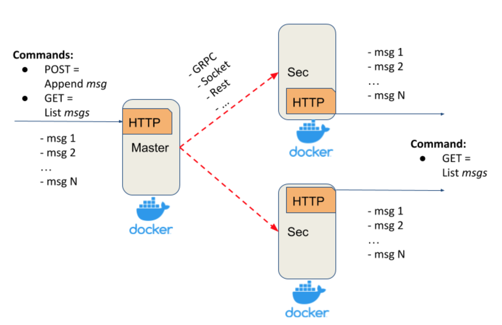

# replicated-log

The Replicated Log is a course project for distributed systems course in Ukrainian Catholic University. It has the following deployment architecture: one Master and any number of Secondaries. Master accepts write requests and replicates the message to all Secondaries.



## How it works

- External communication: REST
  - Master
    - POST - Append message
    - GET - returns list of messages
  - Secondary
    - GET - returns list of messages
- Node communication: REST

## Message format

`json` with the following fields:

```json
{
    "write_concern" : 4,
    "message": "msg_log"
}
```

## Directory structure

Project contains one directory for each team member. Every directory contains master and secondary directory with corresponding implementation inside.

## Useful commands

### Send REST message from the command line

```bash
curl -iv -X POST "http://localhost:55555/" -d '{"write_concern": 4, "message": "my cool text message"}' 
```
